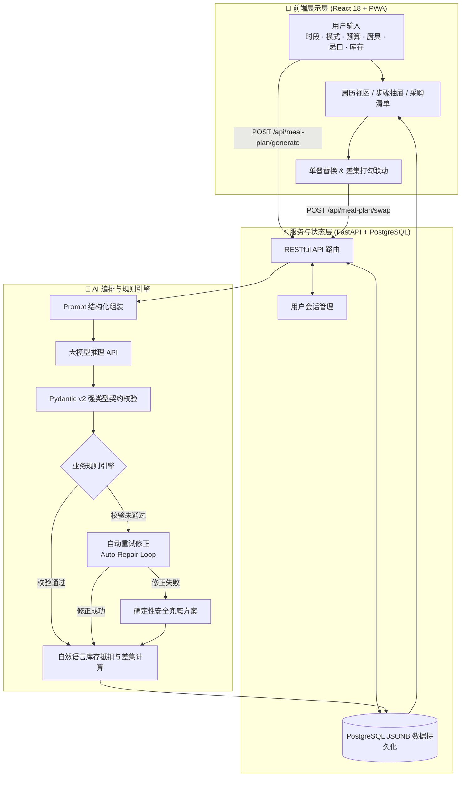

# 一周好好吃 · MealPlanner AI

> 面向独居生活的 AI 周餐规划助手：自由选择周一至周日的早中晚餐，输入预算、口味、忌口与库存，生成 1 至 21 顿快手餐及低损耗采购清单。

[](https://react.dev/)
[](https://fastapi.tiangolo.com/)
[](https://www.postgresql.org/)
[](https://web.dev/progressive-web-apps/)

**[在线体验 (真实全栈已上线)](http://154.8.153.135)** · **[GitHub Pages 镜像](https://sinera-kiki.github.io/wanting-meal-planner/)** · **[查看源码](https://github.com/Sinera-kiki/wanting-meal-planner)**

---

## 📱 产品界面

<table>
  <tr>
    <td width="25%" align="center">
      
      <br />
      <sub><b>1. 餐次选择与快捷方案</b></sub>
    </td>
    <td width="25%" align="center">
      
      <br />
      <sub><b>2. 动态周餐单</b></sub>
    </td>
    <td width="25%" align="center">
      
      <br />
      <sub><b>3. 单餐步骤与换菜</b></sub>
    </td>
    <td width="25%" align="center">
      
      <br />
      <sub><b>4. 库存抵扣与采购单</b></sub>
    </td>
  </tr>
</table>

---

## 🎯 业务背景与用户痛点

在独居做饭场景下，用户的核心痛点通常不在于“单道菜怎么做”，而在于**周维度的决策成本与食材损耗**：

| 核心痛点 | 实际场景 | 本项目解法 |
|---|---|---|
| **单餐菜谱割裂** | 现有菜谱 App 仅针对单道菜，无法规划一整周食材如何交叉复用，导致每次采购买多用少。 | 以周为单位联合生成餐单与采购清单，算法优先复用同一包装原料。 |
| **生鲜规格错配** | 超市绿叶菜通常按 300~500 克包装销售，单人开伙容易在周四前后放蔫腐烂。 | 时序调度机制：易坏绿叶菜优先排在周一至周三，耐储蔬菜安排在周末。 |
| **中途换菜连锁反应** | 某天想临时换一道菜，之前列好的整周采购清单全部失效。 | 局部重规划：换菜仅更新当前餐次，差集算法自动计算采购清单的增减项。 |
| **工作日决策疲劳** | 下班精力耗尽，每天在“吃什么、买什么、做多久”之间反复犹豫，最终妥协点高油外卖。 | 首屏预设 4 种快捷方案，并支持一键沿用上次配置，3 秒完成决策。 |

---

## 🧩 产品功能与交互设计

### 1. 动态餐次自由组合（1 至 21 顿）
- **产品交互**：提供 7 天 × 3 餐的点击矩阵，用户可按实际开伙节奏自由勾选（例如只做周一到周五晚餐，或周末做两顿）；
- **预设模板**：提供“工作日晚餐（5顿）”、“每天晚餐（7顿）”、“常用方案（9顿）”、“全周三餐（21顿）”快捷切换。

### 2. 双层个性化（渐进式配置）
- **第一层：快捷模式（降低冷启动门槛）**
  - **不挑，合理搭配**（默认）：不设偏好限制，系统在米饭、面食、粉类、杂粮间自动轮换；
  - **15分钟快手**：精简烹饪步骤，优先一锅出；
  - **家常均衡**：以米饭搭配家常热炒为主；
  - **轻食少油**：主打清爽少油、优质蛋白质与高纤维杂粮。
- **第二层：按需展开的自定义偏好（满足精细需求）**
  - 主食选择（米饭 / 面食 / 粉类 / 杂粮轻食多选）；
  - 烹饪耗时（10 / 15 / 30 / 45 分钟）；
  - 可用厨具（灶台 / 微波炉 / 电饭锅 / 空气炸锅 / 无厨具）；
  - 忌口与口味（输入不吃食材与偏好味型）。
- **第三层：偏好记忆与跨周生命周期**
  - 首次生成后自动持久化用户偏好，下次访问可直接“沿用上次设置”；
  - 进入新的一周时，系统自动收起过期餐单并友好提示，保留用户的历史偏好与库存输入。

---

## 🏗️ 产研架构与技术实现



---

## 💡 AI 工程化与确定性约束机制

在架构设计上，本项目明确划分大模型与业务逻辑的职责边界：**大模型负责菜品搭配创意，确定性代码负责安全与业务硬约束**。

### 1. 结构化契约与三层容错机制
1. **Prompt 契约**：严格约束 JSON 输出格式、固定 Slot 映射（如 `mon-d`）、菜品字段与步骤数组规范；
2. **Pydantic 运行时校验**：对返回的嵌套数据做类型与数值区间校验（`minutes >= 5`、原材料分类枚举等）；
3. **自动修正与安全降级**：当规则引擎判定不合规时，将具体错误原因注入 Prompt 自动重试修正一次；若仍未通过，平滑降级至具备完整营养结构的安全备用方案。

### 2. 忌口拦截与蛋白质动态替代
- 维护忌口词根与同义词映射表（例如输入“牛肉”自动拦截“肥牛/牛柳”，输入“肉类”自动拦截全部动物蛋白）；
- 对生成的菜品标题与全部原材料进行双重过滤扫描；
- 在降级备用方案中，通过 `_safe_protein()` 动态选择合规蛋白质（豆腐/虾仁/鹰嘴豆等），避免过敏原穿透。

### 3. 自然语言库存解析与智能抵扣
针对用户非结构化文本输入（如 `2个番茄、1包粉丝、半包挂面、200克青菜`）：
- 采用多语序正则解析数量、单位与食材名称；
- `_canonical()` 统一食材别名（如“西红柿”归一为“番茄”）；
- 跨餐次汇总采购需求后，按规格比例抵扣现有库存，已完全覆盖的食材自动从采购单移除并展示在“家中库存已抵扣”栏目中。

### 4. 局部换菜与采购增量差集
- 换菜仅替换当前餐次，保持原有日期、餐型与其余餐单稳定；
- 换菜逻辑优先复用现有采购池中的原料；
- `_shopping_diff()` 比较换菜前后的采购清单，精准计算增减项（如 `新增：金针菇 +100克`、`调减：小青菜 150克`），且**不重置用户已完成的采购打勾进度**。

### 5. 真实性与周级多样性控制
- **真实耗时约束**：对“炖、焖饭、卤、煲汤”等慢烹饪方式设置最低耗时底线，防止模型将慢炖菜伪装为 10 或 15 分钟快手菜；
- **单餐三要素校验**：每餐原材料必须同时覆盖主食、蛋白质源和蔬果三类；
- **厨具物理约束**：在“微波炉 / 空气炸锅 / 无厨具”配置下，严格禁止出现热锅、翻炒、焯水等需要明火灶台的步骤；
- **周级多样性控制**：5 顿以上餐单强制执行单一主食大类占比 ≤ 45%、同种蛋白质出现次数 ≤ 3 次，防止全周主食或蛋白质过度重复。

---

## 🛠️ 技术栈选型

| 模块 | 技术选型 | 说明 |
|---|---|---|
| **前端应用** | React 18 + TypeScript + Vite | 现代化 SPA 架构，组件化与状态流转清晰 |
| **移动端体验** | CSS 自适应 + Safe Area + PWA | 针对手机端竖屏优化，支持 Safari “添加到主屏幕” |
| **后端框架** | Python 3.11 + FastAPI + Pydantic v2 | 异步支持大模型 API 调用，数据模型序列化与校验性能优异 |
| **数据库** | PostgreSQL + JSONB | 关系型字段索引与嵌套餐单数据的高效读写 |
| **部署方案** | Nginx + Systemd (腾讯云全栈已上线) / GitHub Pages (公网镜像) | 云端生产全栈常驻运行 + 公网高保真交互演示版 |

---

## 📡 核心 API 规范

| 请求方式 | 接口路径 | 功能描述 | 核心入参 / 返回说明 |
|---|---|---|---|
| `POST` | `/api/meal-plan/generate` | 生成全周餐单及采购清单 | `Preferences` ➡️ `Plan` (包含 meals, shoppingList, pantryUsed) |
| `POST` | `/api/meal-plan/swap` | 单餐替换并计算采购差集 | `{ preferences, plan, mealId }` ➡️ `Plan` (包含 lastShoppingDelta) |
| `GET` | `/api/meal-plan/current` | 获取当前生效餐单与状态 | 返回已存 plan、preferences、checkedItems 及 stale 状态 |
| `PUT` | `/api/meal-plan/checks` | 同步采购清单打勾状态 | `{ checkedItems: string[] }` ➡️ `{ ok: true }` |
| `GET` | `/health` | 服务健康检查探针 | `{ ok: true }` |

---

## 🚀 本地快速启动

### 1. 克隆代码仓库

```bash
git clone https://github.com/Sinera-kiki/wanting-meal-planner.git
cd wanting-meal-planner
```

### 2. 配置环境变量

```bash
cp .env.example .env
```

编辑 `.env` 文件，填入大模型 API 配置及 PostgreSQL 连接参数：

```properties
APP_LLM_BASE_URL=https://api.deepseek.com/v1
APP_LLM_API_KEY=your-api-key
APP_LLM_MODEL=deepseek-chat
APP_DB_HOST=127.0.0.1
APP_DB_PORT=5432
APP_DB_NAME=meal_planner
APP_DB_USER=postgres
APP_DB_PASSWORD=your-db-password
```

### 3. 安装依赖并启动

```bash
bash install.sh
bash start.sh
```

服务启动后，访问 `http://localhost:3000` 即可开始使用。

### 4. 运行公开演示模式（无需数据库与 API Key）

```bash
cd frontend
npm ci
VITE_DEMO_MODE=true npm run dev
```

---

## 📝 总结与思考

在本项目的设计与开发过程中，核心在于将一个模糊的日常生活需求转化为严谨的产研工程方案：

1. **从“单点生成”到“全链路闭环”**：
   单纯调用模型生成菜名价值有限，真正的产品价值在于将“用餐时段规划 ➡️ 菜品做法 ➡️ 原料采购 ➡️ 库存抵扣 ➡️ 单餐微调”打通为完整使用闭环；
2. **从“个人偏好”升维至“通用方案”**：
   将作者个人的饮食习惯抽象为“通用默认 + 场景快捷方案 + 偏好记忆”分层架构，既保障了新用户的普适体验，又保留了老用户的一键复用能力；
3. **合理划分 AI 与规则的职责边界**：
   不把忌口安全、真实耗时与食材保质期调度寄托于 Prompt 自觉遵守，而是构建确定性的拦截与修正引擎，实现稳定性与创意的平衡。

---

## 📄 开源协议

本项目采用 [MIT License](LICENSE) 授权许可。
