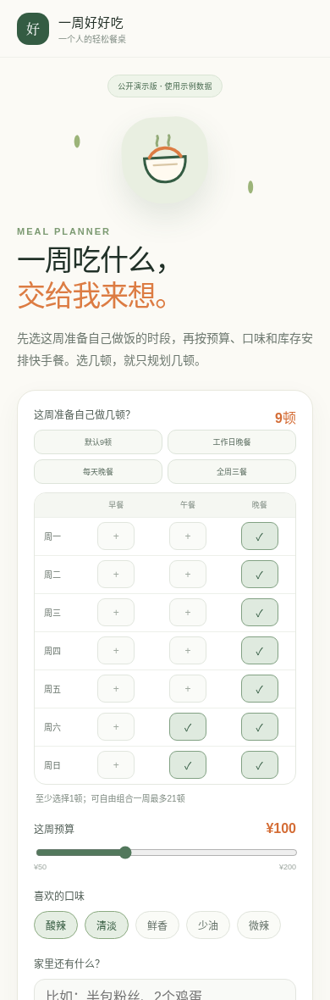
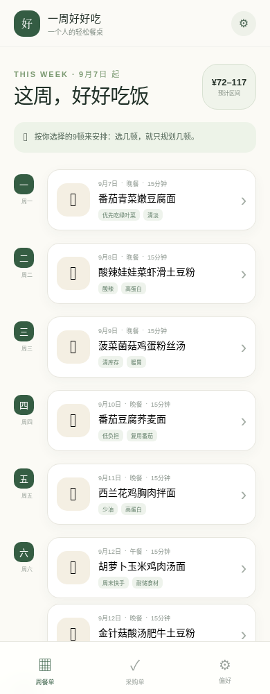
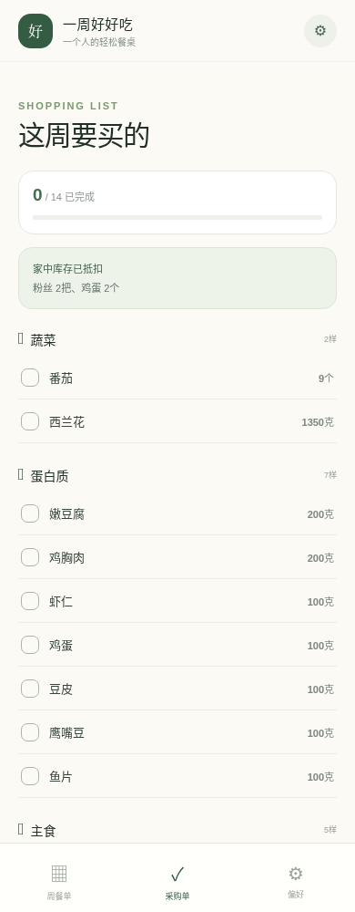
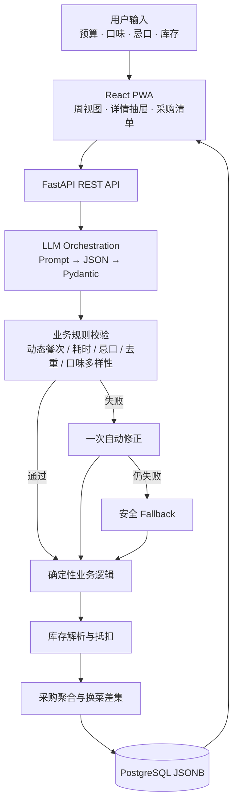

# 一周好好吃 · MealPlanner AI

> 面向独居生活的 AI 周餐规划助手：自由选择周一至周日的早餐、午餐和晚餐，输入预算、口味、忌口与库存，生成 1～21 顿快手餐及低损耗采购清单。

[](https://react.dev/)
[](https://fastapi.tiangolo.com/)
[](https://www.postgresql.org/)
[](https://web.dev/progressive-web-apps/)

**[在线体验 Demo](https://sinera-kiki.github.io/wanting-meal-planner/)** · **[查看源码](https://github.com/Sinera-kiki/wanting-meal-planner)**

> 公开 Demo 使用本地示例数据，不请求真实 AI，也不会上传输入；完整仓库保留了可配置的 LLM、PostgreSQL 与状态持久化实现。

## 产品背景

### 不是再做一个菜谱 App

独居用户真正困难的往往不是“某道菜怎么做”，而是：

- 每天下班后重复决定“今晚吃什么”，决策成本高；
- 单篇菜谱以一道菜为单位，无法解决一整周食材如何复用；
- 生鲜包装规格与单人食量不匹配，绿叶菜尤其容易放坏；
- 临时换掉一顿饭后，原采购清单随即失效。

因此，这个项目将问题重新定义为：

> **在预算、时间、忌口、库存和保质期约束下，为一个人完成“周餐单 → 做法 → 采购量”的联合规划。**

系统提供“工作日晚餐”“每天晚餐”“默认9顿”“全周三餐”等快捷模板，也支持逐格选择；默认仍是工作日5顿晚餐、周末4顿午晚餐，每顿控制在15分钟左右。

## 产品演示

<table>
  <tr>
    <td width="25%"></td>
    <td width="25%"></td>
    <td width="25%"></td>
    <td width="25%"></td>
  </tr>
  <tr>
    <td align="center">预算与偏好</td>
    <td align="center">动态周餐单</td>
    <td align="center">单餐步骤与换菜</td>
    <td align="center">库存抵扣与采购勾选</td>
  </tr>
</table>

## 核心功能

| 模块 | 能力 |
|---|---|
| 动态周计划 | 用户自由勾选一周三餐，按实际选择生成 1～21 顿餐单 |
| 15 分钟快手餐 | 每顿包含时间、食材用量、营养说明和 3 步做法 |
| 低损耗调度 | 绿叶菜优先安排在周一至周三，耐储食材用于周末收尾 |
| 库存抵扣 | 解析“2个鸡蛋、半包粉丝”等自然语言库存并从采购量中扣除 |
| 单顿换菜 | 局部替换一餐，而不是推翻整周计划 |
| 采购差集 | 换菜后明确展示新增与减少的食材 |
| 状态持久化 | 保存本周餐单、偏好和采购勾选，刷新后自动恢复 |
| 移动端 PWA | iPhone Safari 可添加到主屏幕，按手机使用场景设计 |

## 技术架构



核心原则是：

> **LLM 负责创造性，确定性规则负责安全性。模型可以犯错，但系统不能直接相信错误。**

## AI 工程化设计

### 1. 结构化输出与三层容错

1. Prompt 明确 JSON 数据契约、固定餐次 ID 和字段范围；
2. Pydantic 对嵌套结构、类型、枚举和数量做硬校验；
3. 业务规则不通过时，将错误原因反馈给 LLM 自动修正一次；仍不合格则进入安全备用餐单。

### 2. 忌口不是提示词，而是硬约束

`_is_banned()` 对忌口词进行同义扩展，例如“牛肉”同时约束“肥牛”，“肉类”覆盖常见动物蛋白。菜名和全部食材都会再次检查，备用方案也通过 `_safe_protein()` 动态选择安全蛋白质。

### 3. 用轻量规则完成库存理解

库存文本支持以下输入：

```text
2个鸡蛋、1包粉丝、半包粉丝、青菜200克
```

系统通过多语序正则、食材别名归一和单位换算，将自然语言库存转成结构化数量；采购清单按规范名称合并后再抵扣库存。

### 4. 局部换菜与采购差集

换菜不是整周重生成。系统保留原日期和餐型，优先复用已购食材，再通过 `_shopping_diff()` 比较换菜前后采购量，输出类似：

```text
新增：金针菇 +100克、荞麦面 +100克
减少：小青菜 -150克、挂面 -100克
```

### 5. 可解释的业务规则

- 严格匹配用户选中的 1～21 个餐次，不擅自补充；
- 菜名不重复；
- 总耗时不超过用户上限；
- 忌口零容忍；
- 绿叶菜主要在前三天消耗；
- 同一主要口味最多出现 4 顿；
- 价格展示为合理区间，避免制造“精确但不可信”的数字。

## 技术栈

| 层级 | 技术 | 说明 |
|---|---|---|
| 前端 | React 18、TypeScript、Vite | 手机优先交互与组件状态管理 |
| PWA | Web App Manifest、Service Worker | 可添加到手机主屏幕 |
| 后端 | FastAPI、Pydantic v2、HTTPX | API、结构化校验与 LLM 编排 |
| 数据库 | PostgreSQL、JSONB | 保存用户偏好、嵌套餐单和勾选状态 |
| AI | OpenAI-compatible LLM adapter | 可替换为任意兼容服务商 |
| 部署演示 | GitHub Actions、GitHub Pages | 自动构建无密钥的安全演示版 |

## 目录结构

```text
wanting-meal-planner/
├── backend/
│   ├── app.py              # 动态餐次、API、AI编排、规则引擎与采购逻辑
│   ├── init_db.py          # 幂等 PostgreSQL 初始化
│   └── test_logic.py       # 核心规则测试
├── frontend/
│   ├── src/App.tsx         # 移动端主交互
│   ├── src/mockPlan.ts     # GitHub Pages 安全演示数据
│   └── public/             # PWA manifest 与图标
├── docs/screenshots/       # README 展示图
└── .github/workflows/      # GitHub Pages 自动部署
```

## 本地运行

### 1. 克隆项目

```bash
git clone https://github.com/Sinera-kiki/wanting-meal-planner.git
cd wanting-meal-planner
```

### 2. 配置环境

```bash
cp .env.example .env
```

填写你的 LLM 和 PostgreSQL 配置。请勿提交真实密钥。

### 3. 安装与启动

```bash
bash install.sh
bash start.sh
```

访问 `http://localhost:3000`。

### 仅运行公开演示模式

```bash
cd frontend
npm ci
VITE_DEMO_MODE=true npm run dev
```

演示模式使用本地样例数据，不需要数据库或 AI Key。

## 安全说明

- 仓库不包含任何真实密钥、内部配置或用户数据；
- `.env`、数据库配置与构建产物默认被忽略；
- GitHub Pages 仅部署静态演示模式，不暴露 LLM 调用能力；
- 若公开部署完整后端，请增加正式鉴权、调用频控和费用上限。

## 项目复盘

这个项目最大的收获不是“调用模型生成菜谱”，而是把一个模糊生活需求拆成了可验证的产品与工程约束：

- 从个人默认的9顿出发，进一步抽象为支持1～21顿的动态餐次模型；
- 将营养、保质期、预算和忌口转化为程序可以判断的规则；
- 用 LLM 处理搭配创意，用规则处理安全与一致性；
- 从单次生成继续补齐换菜、采购差异和跨刷新保存，形成完整使用闭环。

## 后续计划

- 接入营养数据库，提供可计算的能量与宏量营养素；
- 引入真实商超包装规格与价格，优化采购量和预算区间；
- 根据历史换菜行为学习个人偏好；
- 支持 2～3 人家庭和备餐模式。

## License

[MIT](LICENSE)
