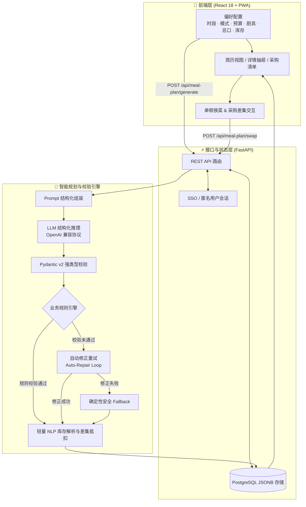

# 一周好好吃 · MealPlanner AI

> 面向独居生活的 AI 周餐规划助手：自由选择周一至周日的早餐、午餐和晚餐，输入预算、口味、忌口与库存，生成 1～21 顿快手餐及低损耗采购清单。

[](https://react.dev/)
[](https://fastapi.tiangolo.com/)
[](https://www.postgresql.org/)
[](https://web.dev/progressive-web-apps/)

**[在线体验 Demo](https://sinera-kiki.github.io/wanting-meal-planner/)** · **[查看源码](https://github.com/Sinera-kiki/wanting-meal-planner)**

> 💡 **Demo 说明**：公开演示版已内置高保真交互模拟器，在浏览器端基于本地规则动态计算库存抵扣与换菜差集，不请求真实大模型，也不会上传任何输入；完整工程已包含通用 LLM 适配器、PostgreSQL 持久化与状态恢复服务。

---

## 📱 产品演示

<table>
  <tr>
    <td width="25%" align="center">
      
      <br />
      <sub><b>1. 餐次选择与快捷方案</b></sub>
    </td>
    <td width="25%" align="center">
      
      <br />
      <sub><b>2. 动态周餐单</b></sub>
    </td>
    <td width="25%" align="center">
      
      <br />
      <sub><b>3. 单餐步骤与换菜</b></sub>
    </td>
    <td width="25%" align="center">
      
      <br />
      <sub><b>4. 库存抵扣与采购单</b></sub>
    </td>
  </tr>
</table>

---

## 🎯 产品背景：不是再做一个菜谱 App

独居年轻人在做饭时真正消耗精力的往往不是“某道菜的具体做法”，而是**周维度的决策疲劳与生鲜损耗**：

- **单餐菜谱断层**：主流菜谱 App 以单道菜为核心，无法解决“买一次菜如何供一周复用”的原料调度问题；
- **生鲜规格错配**：超市绿叶菜一份常为 300~500g，独居单人做饭极易在前三天放蔫放烂；
- **临时换菜连锁反应**：中途换掉一顿饭，原定采购计划直接失效；
- **每天重复决策**：下班后精力耗尽，在“吃什么”、“买什么”和“做多久”之间犹豫不决，最终妥协点高油高盐外卖。

因此，本项目将问题重新定义为：

> **在用餐时段、预算、烹饪时长、厨具、忌口和库存的联合约束下，为独居用户完成“动态周餐单 → 快手步骤 → 零损耗采购清单”的一体化规划。**

系统默认提供“工作日晚餐（5顿）”、“每天晚餐（7顿）”、“常用方案（9顿）”、“全周三餐（21顿）”等快捷模板，也支持任意 1~21 顿自由勾选，单餐耗时支持 10~45 分钟弹性配置。

---

## 🧩 双层个性化设计

为了兼顾“新用户零门槛快速上手”与“老用户长期使用省心”，产品采用渐进式交互结构：

1. **第一层：通用默认 + 场景快捷方案（3秒完成）**
   - **不挑，合理搭配**（默认）：不预设主观口味，系统自动在米饭、面食、粉类、杂粮间均衡轮换；
   - **15分钟快手**：步骤简化，优先一锅出；
   - **家常均衡**：以米饭和经典炒菜/炖菜为主；
   - **轻食少油**：清爽低负担、少油轻烹饪。
2. **第二层：按需折叠的高级偏好（给有明确需求的用户）**
   - 主食偏好（米饭 / 面食 / 粉类 / 杂粮轻食多选）；
   - 餐食风格（家常菜 / 一锅端 / 轻食 / 汤羹）；
   - 每餐时长（10 / 15 / 30 / 45 分钟）；
   - 可用厨具（灶台 / 微波炉 / 电饭锅 / 空气炸锅 / 无厨具）；
   - 目标味型（酸辣 / 清淡 / 鲜香 / 微辣）。
3. **第三层：偏好记忆与跨周生命周期管理**
   - **偏好记忆**：生成后自动保存当前设置，下次进入可一键“沿用上次设置”，无需重复输入；
   - **跨周生命周期**：进入新的一周时，系统自动收起上周餐单并温馨提示，同时完整保留用户的偏好设置与库存输入习惯。

---

## 🏗️ 系统架构



**设计哲学**：
> **LLM 负责创造性搭配，确定性规则引擎负责安全性与业务硬约束。模型可以犯错，但系统不能直接相信不可信输出。**

---

## 💡 AI 工程化与可信度设计

### 1. 结构化输出与三层容错闭环
- **第一层（Prompt 契约）**：严格限定 JSON Schema、固定餐次 Slot ID、字段取值集合与步骤格式；
- **第二层（Pydantic 运行时校验）**：强校验字段类型、数值区间（`minutes >= 5`）、食材枚举与步骤数组长度；
- **第三层（自动修正与安全降级）**：规则校验不通过时，提取具体错误信息反馈给模型自动修正一次；仍不合格则平滑降级至具备完整营养结构的安全备用方案。

### 2. 忌口零容忍与同义词泛化
- `_is_banned()` 建立词根与同义词映射表（例如输入“牛肉”自动拦截“肥牛/牛柳”，输入“肉类”自动拦截全品类动物蛋白）；
- 对菜品标题与全部原材料进行双重过滤扫描；
- 备用方案中通过 `_safe_protein()` 动态计算安全替代蛋白质（豆腐/虾仁/鹰嘴豆等），杜绝过敏原穿透。

### 3. 轻量规则驱动的库存智能抵扣
支持非结构化中文文本输入（如 `2个番茄、1包粉丝、半包挂面、200克青菜`）：
- 采用多语序正则解析数量、单位与名称；
- `_canonical()` 统一食材别名（“西红柿”归一为“番茄”，“土鸡蛋”归一为“鸡蛋”）；
- 跨餐次汇总采购需求后，按规格比例精确抵扣库存，已完全覆盖的食材自动从采购单移除并标注在“家中库存已抵扣”面板。

### 4. 局部换菜与采购增量差集
- 换菜只替换当前选中的单餐，保持原有日期、餐型与其余 90%+ 餐单稳定；
- 换菜算法优先复用现有采购池中的原料；
- `_shopping_diff()` 比较换菜前后采购清单，精准返回增减标签（如 `新增：金针菇 +100克`、`减少：小青菜 -150克`），且**不重置用户已完成的采购打勾进度**。

### 5. 真实性与周级多样性约束
- **真实耗时约束**：对“炖、焖饭、卤、煲汤”等慢烹饪方式设置最低耗时底线，杜绝“10分钟做红烧牛肉”等虚假快手菜；
- **单餐结构硬校验**：每餐原材料必须同时覆盖主食、蛋白质源和蔬果三要素；
- **厨具排他校验**：在“微波炉 / 空气炸锅 / 无厨具”场景下，严格禁止出现热锅、翻炒、焯水等需要明火灶台的步骤；
- **周级多样性控制**：5 顿以上餐单强制执行主食大类占比 ≤ 45%、同种蛋白质出现次数 ≤ 3 次，防止连吃整周同一品类。

---

## 🛠️ 技术栈选型

| 架构分层 | 核心技术 | 选型理由 |
|---|---|---|
| **前端框架** | React 18 + TypeScript + Vite | 组件化开发、强类型安全、秒级构建 |
| **移动端适配** | CSS 自适应 + Safe Area + PWA | 手机端沉浸式使用，支持 Safari “添加到主屏幕” 离线运行 |
| **后端服务** | Python 3.11 + FastAPI + Pydantic v2 | 异步原生支持大模型流式调用，数据校验性能优异 |
| **持久化存储** | PostgreSQL + JSONB | 兼顾结构化元数据索引与嵌套餐单数据的高效读写 |
| **网络与客户端** | HTTPX AsyncClient + Native Fetch | 连接池复用、异步非阻塞、支持超时与重试 |
| **部署与交付** | GitHub Actions + GitHub Pages | 持续集成构建，自动部署安全零密钥的前端交互演示版 |

---

## 📡 核心 API 规范

| 方法 | 路径 | 描述 | 核心入参 / 响应 |
|---|---|---|---|
| `POST` | `/api/meal-plan/generate` | 生成全周餐单及采购清单 | `Preferences` ➡️ `Plan` (含 meals, shoppingList, pantryUsed) |
| `POST` | `/api/meal-plan/swap` | 单餐替换并计算采购差集 | `{ preferences, plan, mealId }` ➡️ `Plan` (含 lastShoppingDelta) |
| `GET` | `/api/meal-plan/current` | 获取当前生效餐单与状态 | 返回已存 plan、preferences、checkedItems 及 stale 状态 |
| `PUT` | `/api/meal-plan/checks` | 同步采购清单打勾状态 | `{ checkedItems: string[] }` ➡️ `{ ok: true }` |
| `GET` | `/health` | 服务健康检查探针 | `{ ok: true }` |

---

## 🚀 本地运行指南

### 1. 克隆代码仓库

```bash
git clone https://github.com/Sinera-kiki/wanting-meal-planner.git
cd wanting-meal-planner
```

### 2. 配置环境变量

```bash
cp .env.example .env
```

编辑 `.env` 文件，填入你的 OpenAI-Compatible 模型接口配置及 PostgreSQL 连接参数：

```properties
APP_LLM_BASE_URL=https://api.deepseek.com/v1
APP_LLM_API_KEY=your-api-key
APP_LLM_MODEL=deepseek-chat
APP_DB_HOST=127.0.0.1
APP_DB_PORT=5432
APP_DB_NAME=meal_planner
APP_DB_USER=postgres
APP_DB_PASSWORD=your-db-password
```

### 3. 一键安装并启动

```bash
bash install.sh
bash start.sh
```

启动完成后，访问 `http://localhost:3000` 即可开始使用。

### 4. 仅运行公开演示模式（无需数据库与 AI Key）

```bash
cd frontend
npm ci
VITE_DEMO_MODE=true npm run dev
```

---

## 📝 项目复盘与思考

在本项目的设计与迭代过程中，最大的收获是将一个模糊的生活痛点转化为严谨的工程模型：

1. **从“个人偏好”升维到“通用产品”**：
   最初版本将作者个人的粉面习惯硬编码为默认规则；在迭代中重构为“通用默认（自动轮换）+ 快捷模板 + 个人记忆”三层架构，既保证了新用户的普适体验，又保留了老用户的一键复用能力。
2. **正确划定 AI 与规则的职责边界**：
   不把忌口、过敏、时间真实性和保质期调度寄希望于 Prompt 的自觉遵守，而是构建确定性的拦截与修正引擎，实现“AI 出创意，规则保安全”。
3. **闭环体验优于单点功能**：
   单纯生成菜单只是 50% 的体验，真正的闭环在于动态餐次自由组合、智能库存扣减、换菜增量联动和跨周状态管理。

---

## 📄 开源协议

本项目采用 [MIT License](LICENSE) 授权许可。
